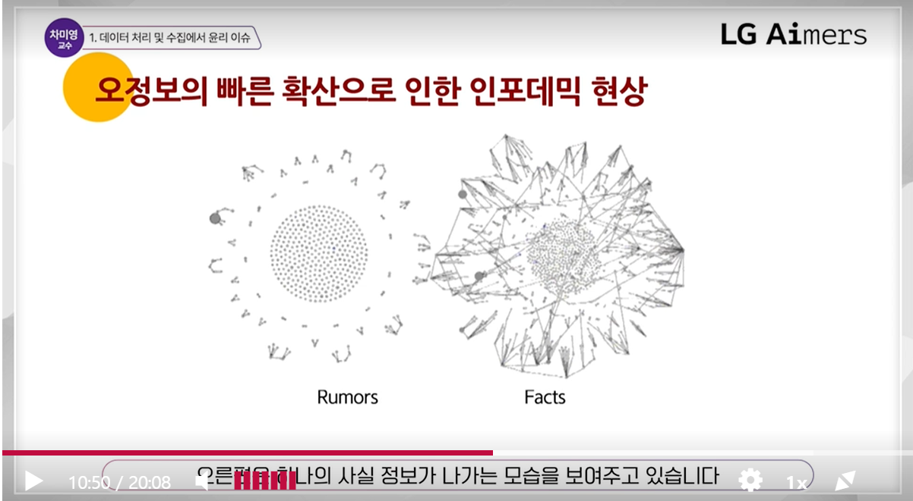
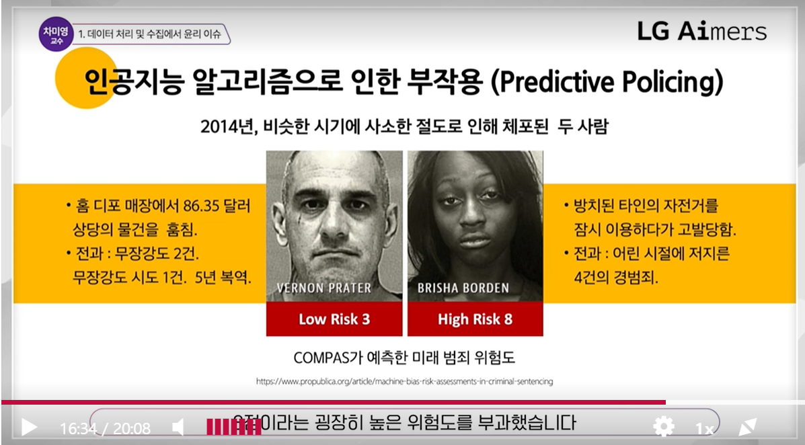

# 1. 데이터 처리 및 수집에서 윤리 이슈

## 데이터의 해석, 오버피팅, 오정보의 탐지, 알고리즘의 편향을 비롯한 윤리와 신뢰 문제

### 1. 데이터를 잘 해석하고 있는가

- 초콜렛을 많이 먹으면 노벨상을 많이 탄다?
- 상관관계는 인과관계가 아니다.

 

### 2. 데이터 전처리와 분석방법은 적절한가

`깨끗한 데이터`

- Error bar 추가하기
- 적합한 통계 테스트 찾기
- 아웃라이어 제거하기(이상값 제거)
- 데이터 표준화
- EDA(exploratory data analysis) 충분한 시간 보내기

깨끗한 데이터를 만들었을 때 학습도 깨끗하고 좋은 결과가 나온다.

 

### 3. 학습에 쓰는 데이터는 충분한가?

`underfitting` `overfitting`

> 데이터가 너무 적은 경우 학습의 결과가 좋지 못할 수 있다.
> 
> 데이터가 너무 많은 경우 데이터에 특화된 학습 모델이 나올 수 있다.

 

### 4. Black Box Algorithm

`알고리즘의 설명력` `사후 설명력 post-hoc explainability`

> 탈세범을 잡는 알고리즘에 세관원들이 왜 따라야하는지 이해할 수 없었다. 성능을 떨어트리고 설명력을 높였더니 쓰일 수 있었다.

알파고에 어떻게 다음 수를 두었는가를 물어보면 답을 하지 못한다. -> 해석하기가 쉽지 않다.
알고리즘의 내면을 가시화 하는 것이 중요

**학습 결과가 바뀔 수 있는 위험성**

> one-pixel attack: 단 하나의 픽셀을 바꿈으로써 결과가 달라진다.

 

### 5. Handling the Web data

`정보의 대표성`

**의견의 대표성: Spiral of silence**

> 목소리가 큰 사람이 의견을 내면 내가 소수라고 생각하고 침묵하고 부각되면 한 가지 의견만 대표성을 가진다고 착각하게 되는 현상

- 인터넷 상의 의견이 대표성 있는 의견이 아닐 수 있음을 인지
- 소셜 링크를 통한 빠른 정보 전파, 봇의 참여, 극단화 현상 주의

**오정보의 빠른 확산으로 인한 인포데믹 현상**

> 오정보는 산발적으로 퍼지고 사실 정보는 모두 연결되어 퍼진다.

_인포데믹: 오정보가 너무 많아 무엇이 오정보인지 사실 정보 인지 구분할 수 없는 현상_

**데이터 사용과 서비스 개발에 사용자 어려움을 반영해야**

**The right to be forgotten**

- 사생활 노출이나 과거 기록에 대해 포털과 인터넷 서비스에서 삭제되지 않아 개인 정보의 과다 노출 피해
- 스페인 변호사 곤살레스 사례(10년 전 빚으로 본인의 집이 경매당한다는 뉴스가 구글에 검색)
- 유럽사법재판소 판결은 원 데이터에 대한 삭제는 인정하지 않되 이 데이터의 검색 결과 에 대한 삭제 요구는 인정될 수 있다고 판결

 

### 6. 윤리에 대한 법적 제도

> GDPR: EU의 제도 - 개인정보의 노출, 과다 광고에 노출, 혹은 혐오 표현의 노출을 규제하는 법

**Digital Services Act**

- 유럽 연합 중심으로 빅테크 기업 대상 플랫폼 유해 콘텐츠 단속 의무 강화
- 네티즌의 성별, 인종, 종교 등에 기반한 알고리즙으로 개인화 추천 광고 노출 금지
- 어린이 대상 개인화 추천 광고 전면 금지
- 혐오 발언, 아동 학대, 테러 선동 등 불법 콘텐츠 유통 막아야

 

### 7. AI Ethical Decisions

> COMPAS 제도: 판사의 보석에 관한 의사 결정에 참고 하는 점수

**인공지능 알고리즘으로 인한 부작용**

흑인이라는 이유로 높은 점수를 부여 받음

 

## 결론

- 데이터의 확보, 전처리, 분석, 해석의 전 과정이 중요

고품질의 데이터기 입력되었을 때 학습 결과도 유의미하며, 
데이터가 가지는 오차 범위와 특이점, 
대표성에 대한 충분한 이해를 가지고 접근해야함

- 알고리즘의 설명력, 편향, 신뢰의 문제에 주의

블랙박스 알고리즘이 실제 사회에서 사용되기 위해서는 많은 경우 설명력 보강이 필요하며, 
노이즈와 데이터 가변성에도 대처 가능한 알고리즘을 개발하도록 노력
AI가 다양한 사회 서비스에서 인간 결정을 돕거나 대체함에 따라 윤리적 의사결정이 확보되도록 점검