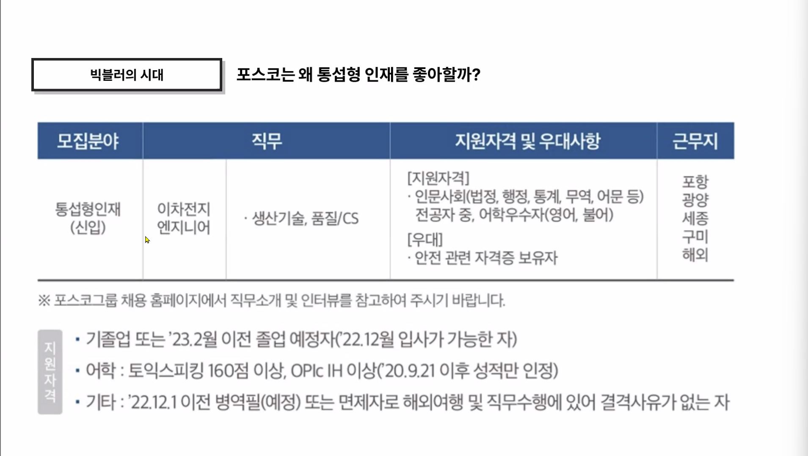
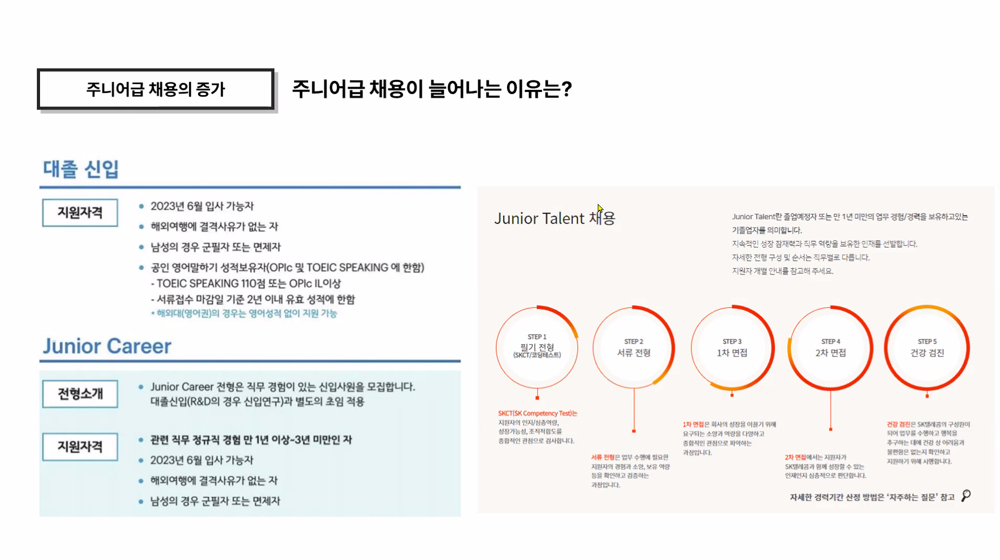
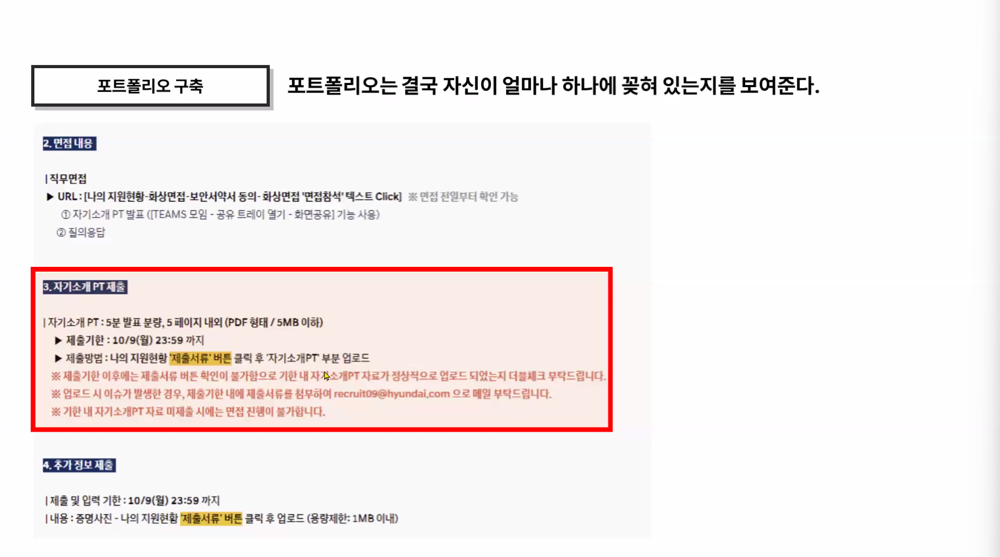
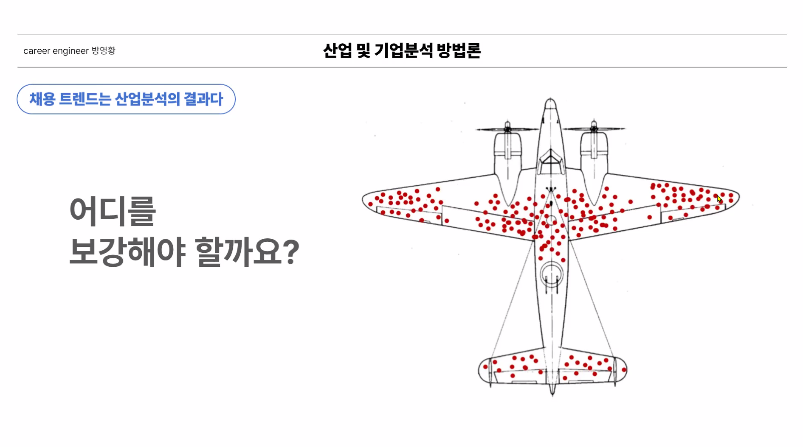
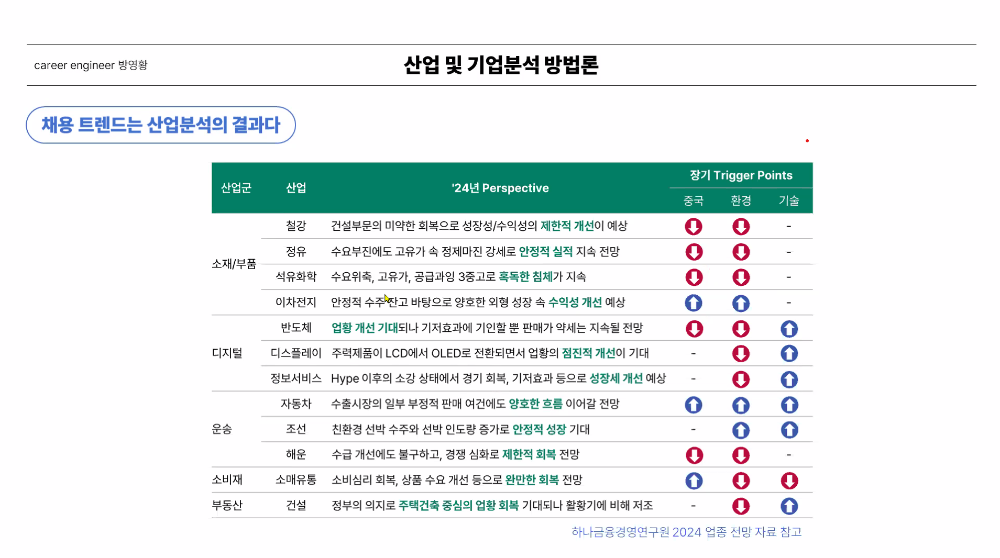
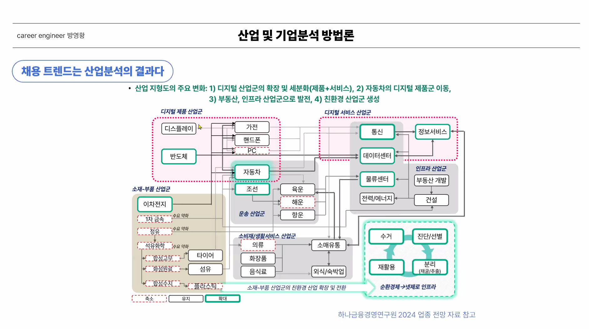

## 산업 및 기업 분석 방법론

1. 데이터 / DX / DT 기본 역량
2. ESG
3. 신산업 분야로의 투자
4. 전문성을 쌓는 쪽으로 이직

**LG, 현대 자동차는 자동화 제어 설비에 집중한다.**

### 포스코는 통섭형 인재를 좋아한다.

이공계학생이 못하는 것 중 인문계학생이 잘할 수 있는 것이 있다.

### 주니어급 채용이 늘어나는 이유는?

왼쪽은 삼양, 오른쪽은 SK!

{ width=50% }

### 포트폴리오는 결국 자신이 얼마나 하나에 꽂혀 있는지를 보여준다.

본인의 인사이트를 표현하는 것이 중요하다.

 

## 채용 트렌드는 산업분석의 결과다.

> 총알을 맞지 않은 부분을 보강해야한다. 살아왔다는 건 맞아도 괜찮다는 부분. 총알을 맞지 않은 부분에 총알을 맞은 경우 살아 돌아오지 못한다.

남들이 다 중요하게 생각하는 부분을 강화한다고 의미가 있어지지는 않는다.

- 이차 전지는 중국의 영향력이 줄어든다.  계속 뽑을 것이다.
- 반도체는 전반적으로 하락세이나 기술이 필요해 엔지니어를 많이 뽑을 것이다.
- 자동차, 조선에서 원할한 흐름이 예상된다.

기술적인 부분이 필요한 경우 논문 리뷰를 많이 보아야한다.

### 산업 지형도

#### 주요 변화
1) 디지털 산업군 확장 및 세분화
2) 자동차의 디지털 제품군 이동
3) 부동산, 인프라 산업군 발전

모빌리티에서 정보서비스는 인문계열을 많이 뽑는다.

