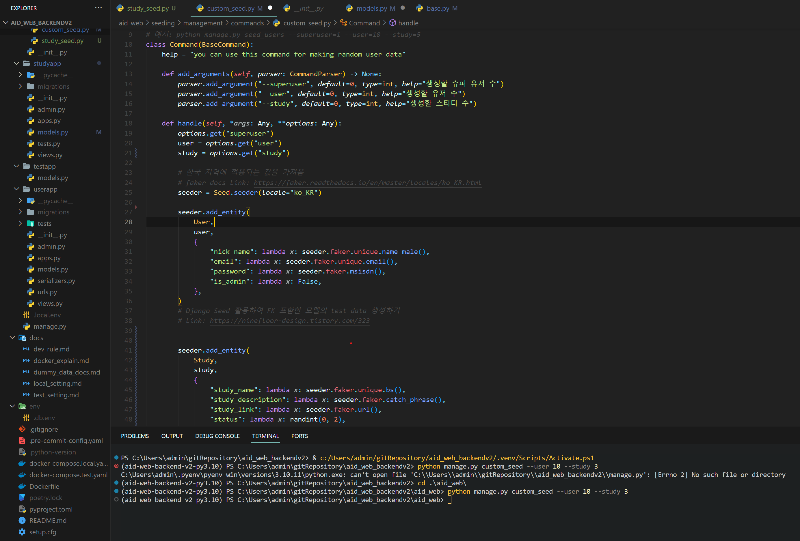
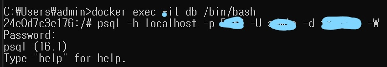
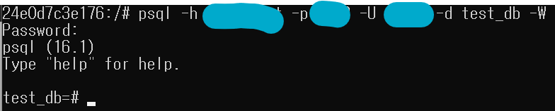
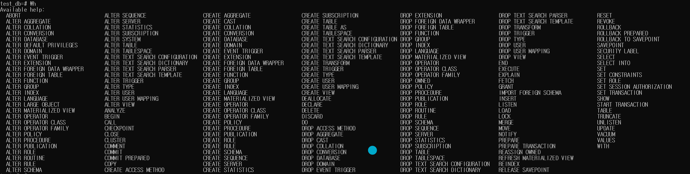
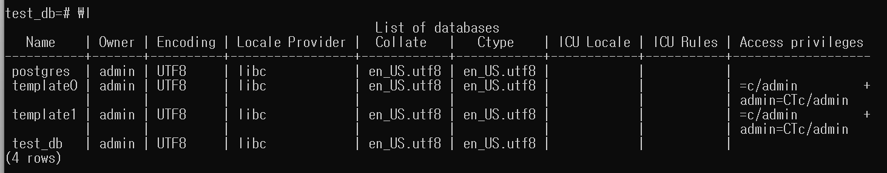
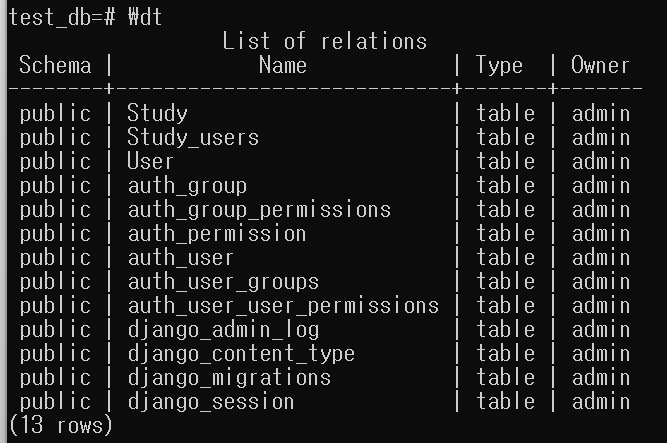
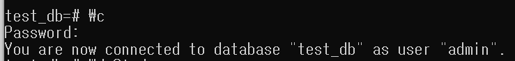
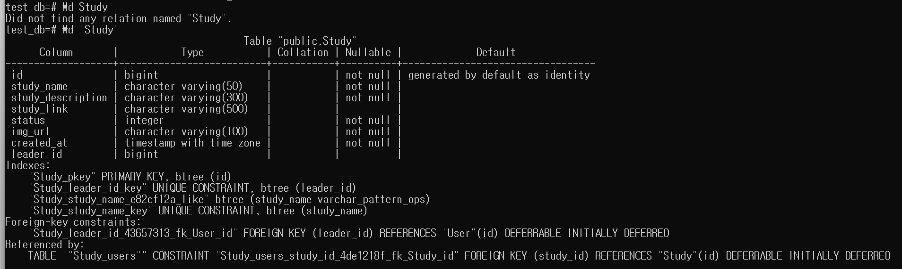
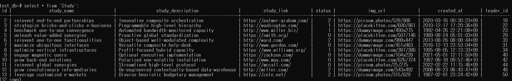

# 목차

1. 더미 데이터를 위한 custom_seed.py 코드
2. 실행 순서

# 1. 더미 데이터



```python
# 코드 전문

from typing import Any
from django.core.management.base import BaseCommand, CommandParser
from django_seed import Seed
from userapp.models import User
from studyapp.models import Study
from random import randint

# 예시: python manage.py seed_users --superuser=1 --user=10 --study=5
class Command(BaseCommand):
    help = "you can use this command for making random user data"

    def add_arguments(self, parser: CommandParser) -> None:
        parser.add_argument("--superuser", default=0, type=int, help="생성할 슈퍼 유저 수")
        parser.add_argument("--user", default=0, type=int, help="생성할 유저 수")
        parser.add_argument("--study", default=0, type=int, help="생성할 스터디 수")

    def handle(self, *args: Any, **options: Any):
        options.get("superuser")
        user = options.get("user")
        study = options.get("study")

        # 한국 지역에 적용되는 값을 가져옴
        # faker docs Link: https://faker.readthedocs.io/en/master/locales/ko_KR.html
        seeder = Seed.seeder(locale="ko_KR")

        seeder.add_entity(
            User,
            user,
            {
                "nick_name": lambda x: seeder.faker.unique.name_male(),
                "email": lambda x: seeder.faker.unique.email(),
                "password": lambda x: seeder.faker.msisdn(),
                "is_admin": lambda x: False,
            },
        )
        # Django Seed 활용하여 FK 포함한 모델의 test data 생성하기
        # Link: https://ninefloor-design.tistory.com/323
        
        seeder.add_entity(
            Study,
            study,
            {
                "study_name": lambda x: seeder.faker.unique.bs(),
                "study_description": lambda x: seeder.faker.catch_phrase(),
                "study_link": lambda x: seeder.faker.url(),
                "status": lambda x: randint(0, 2),
                "img_url": lambda x: seeder.faker.image_url()
            }
        )
        
        seeder.execute()
```

# 2. 실행 순서

1. docker desktop 실행
2. 폴더 위치 기본으로 변경
3. `docker compose -f {filename.yaml} up -d`, `cd aid_web`, `python manage.py runserver [--settings=config.settings.local]` 순서대로 입력
4. postgres 설치 확인, 해당 경우에는 가상 환경 설치 리스트에 등록되 있음.
5. db container 가동 확인 <br>
<br>
6. cmd 에 `docker exec -it {container_name} /bin/bash`입력<br>
<br>
7. `psql -h ___ -p ___ -U ___ -d ___ -W` 입력<br>
<br>
   - psql -h {host} -p {port} -U {user_name} -d {db_name} -W(:password 사용)<br><br>
8. psql 진입 후 조회 명령어<br>
   - \h: 도움말 조회 + \h {instruction_name} ex) \h select<br>
   <br>
   - \l: 모든 database 조회<br>
   <br>
   - \dt: 모든 테이블 조회<br>
   <br>
   - \c {db_name} {user_name}: 해당 db로 user의 조회 위치 변경<br>
   <br>
   - \d "{table_nae}": **"" 필수!!!! 이것 때문에 개고생함.** 테이블 상세 정보 조회<br>
   <br>
   - \q: psql 종료<br><br>

9. Table 조회 **(명령어는 mysql 과 비슷하지만 Table 이름은 대소문자 구분, "" 필수, ; 필수)**
    ```psql
    # 마찬가지 "" 필수!!
    select * from "{table_name}"; # ; 필수!!!!!!!!!!!
    ```
    
