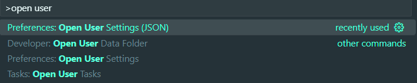
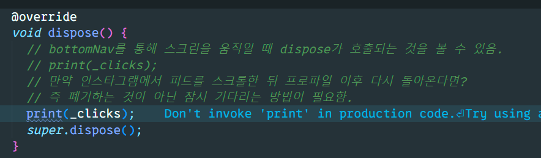
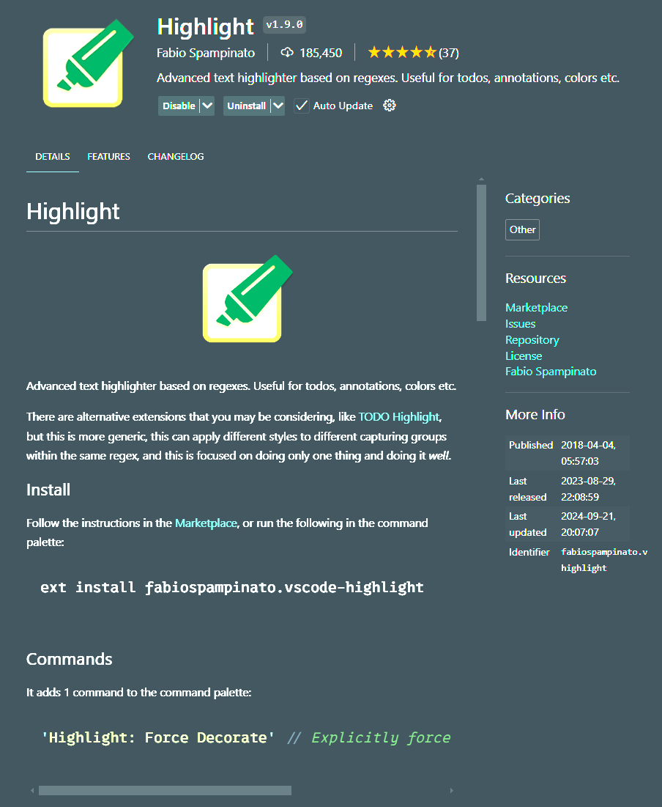
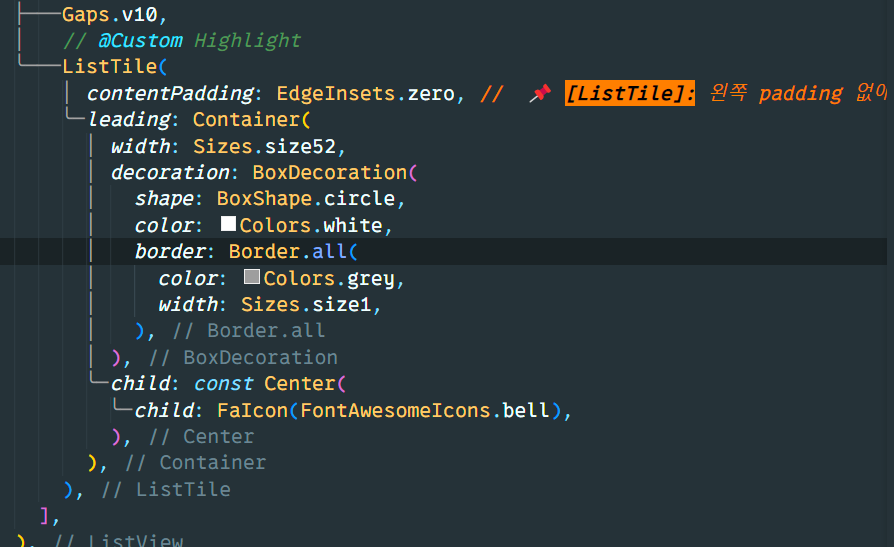

노마드 코더 클론 코딩 중에 주석이 너무 알아보기가 힘들어서 
꼭 기억해야하는 요소들은 [ ]안에 위젯 이름과 함께 잘 보일 수 있게 만들고 싶었는데
2~3 시간 걸려서 찾은 거니 잘 참고했으면 좋겠다.

# 주석 커스텀 하이라이트 (Comment Custom Highlight)

<br>

## 1. 기본 주석 설정

---

1. Open User Settings (setting.json)
2. 주석 색 변경 코드 붙여넣기
3. 확인하기 

<br>

vscode는 기본적으로 주석 색이 회색으로 되어있다. 그래서 알아보기가 힘들다.


<br>

먼저 **ctrl + shift + p**를 누른 뒤 `open user settings`를 입력한다.



<br>

`settings.json` 파일이 열리면 아래의 코드 원하는 색상으로 수정한 뒤 다음 그림과 같이 입력한다.

```json
"editor.tokenColorCustomizations": {
    "comments": "#539557" #ColorCode
},
```


```json
# settings.json
{
  ...,
  
  "editor.tokenColorCustomizations": {
    "comments": "#539557" #ColorCode
  },
  
  ...
}
```
<br>

그럼 아래와 같이 주석 색상이 변경된다.



<br>

## 2. Custom Highlight

---

1. Extension 설치
2. 코드 변경
3. 세부 설정

VSCode에 `Highlight`Extension을 설치한다. _`TODO HIGHLIGHT`는 설치했지만 Custom하기가 어렵다._



<br>

마찬가지로 `settings.json`으로 들어가 다음과 같이 코드를 작성한다.

```json
"highlight.regexes": {
    "(// ?\\s*)(\\[.*\\]:?)(.*)": {
      "decorations": [
        // 첫 번째 괄호: (// ?\\s*)
        {
          "color": "#FF7F00",
        },
        // 두 번째 괄호: (\\[.*\\]:?)
        {
          "overviewRulerColor": "#379d39",
          "backgroundColor": "#FF7F00",
          "color": "#000000",
          "fontWeight": "bold",
          "before": { "contentText": "📌 " }, 
          "after": {"contentText": ""},
        },
        // 세 번째 괄호: (.*)
        {
          "color": "#FF7F00",
        }
      ]
    },
    "(// )(@\\w+)": [
      {},
      {
        "color": "#4de0ff"
      },
      {},
    ]
}
```

<br>

아래는 적용 후 모습이다.

