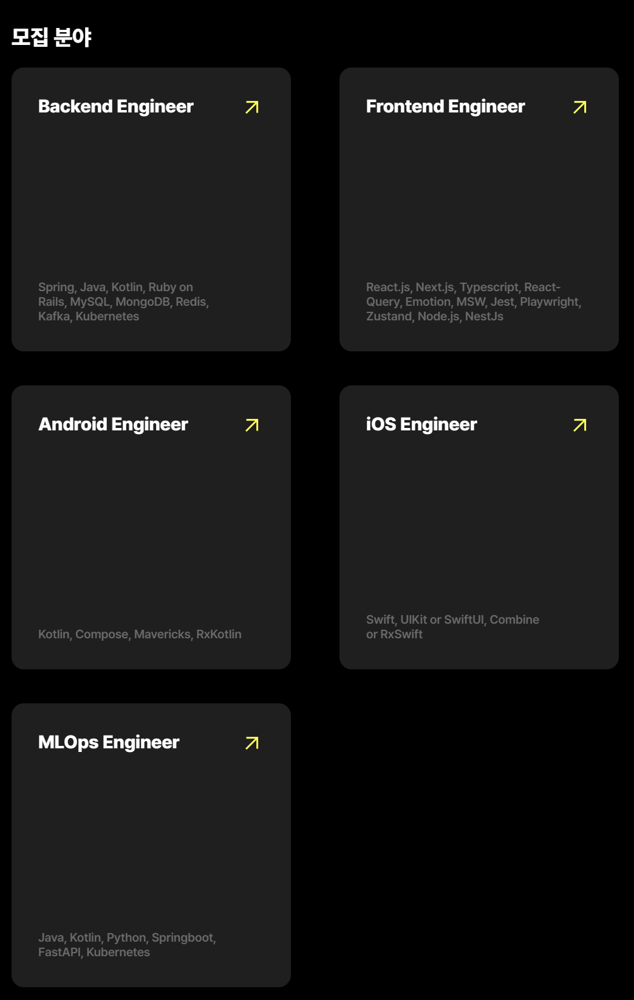
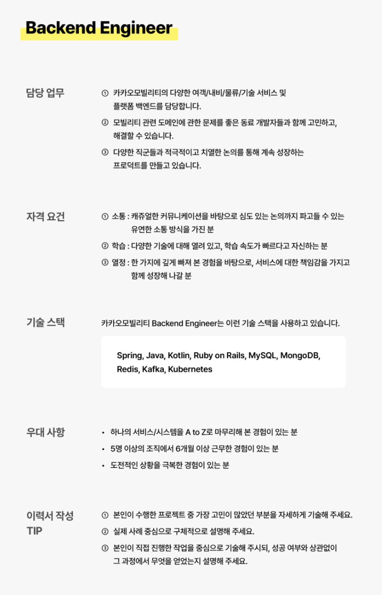
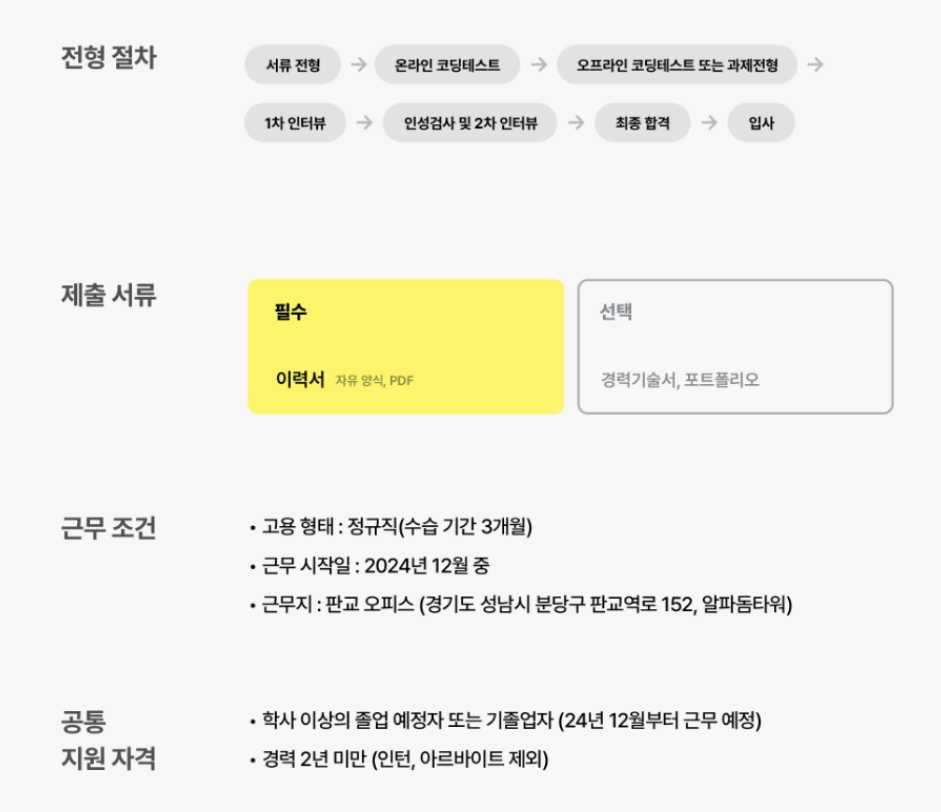

---

### MEMO (2024-09-30)

링크드인 돌아다니다가 재밌어 보여서 지원하고 기대도 안하고 있어서 까먹었는데 서류에 붙었다.

이번으로 대기업에 두 번째 서류에 붙는 건데 잘됐으면 좋겠다.

근데 카카오 제주 부트캠프랑 지금 헷갈리는 게 많은 것 같다 조심하자.

 

### 모집 분야

총 5개 분야에서 모집을 했고 나는 백엔드에 지원을 했다.

 

 

### BackEnd Engineer 설명

 

 

#### 자격 요건

내가 가장 자신있는 부분이자 포트폴리오에 잘 드러났던 부분인 것 같다. 

- 소통: <U>캐쥬얼한 커뮤니케이션을 바탕</U>으로 심도있는 논의까지 파고들 수 있는 유연한 소통 방식을 가진 분
- 학습: 다양한 <U>기술에 대해 열려</U> 있고, <U>학습 속도가 빠른</U> 분
- 열정: <U>한 가지에 깊게 빠져 본 경험</U>을 바탕으로, 서비스에 대한 <U>책임감</U>을 가지고 함께 성장해 나갈 분

 

**추후에 면접에서는 이 부분을 잘 어필하자.**

오늘 생각난 멘트

    원래 이루고자 했던 꿈을 포기하고 22년 7월부터 컴퓨터 전공에 대해 학습을 시작했다.
    만 1년이 조금 더 된 23년 10월에 있었던 졸업과제에서 4년 간 공부했던 학우들과 경쟁하여 총 52개 팀 중 은상을 수상했다.
    또 만 2년이 조금 더 흐른 지금 시점에서 카카오 모빌리티에 지원하여 면접까지 올 수 있었다.
    혈혈단신과 살아남을 궁리만으로 2년 만에 제가 여기까지 왔고 성장했음을 알아봐주신 면접관님들이
    카카오와 함께 한 저의 5년 뒤 모습을 한번 상상해봐주셨으면 좋겠다.
    저를 뽑은 것을 절대로 후회하시지 않게 만들 자신이 있음을 마지막으로 알려드리고싶다.

 

#### 기술 스택

적당히 대비해야할 것 같다.

|해본 것|해보지 않은 것|
|:--:|:--:|
|Spring, Java, MySQL, Kubernetes, Kotlin(이건 맛보기)| Ruby on Rails, MongoDB, Redis, Kafka |

 

#### 우대 사항

졸업 과제에 계획서 작성부터 저작권 등록까지로 얘기를 잘 해보면 될 것 같다.

도전적인 상황은 졸업과제에서 시간적 압박이 엄청나게 많았던 것을 어필하면 될 것 같다.

 

### 그 외 사항

5개의 관문 중 이제 1개의 관문을 넘었다. 나머지도 잘 할 수 있도록 기도하고 노력하자.

[//]: # (~~&#40;사실 포트폴리오는 지인이 재직중인 회사에 지원하기 위해서 작성했던 것이고 지인이 5번 넘게 피드백 해주셨던 포트폴리온데)

[//]: # (그 회사는 떨어지고 여기가 붙었다.. ㅋㅋㅋ&#41;~~)