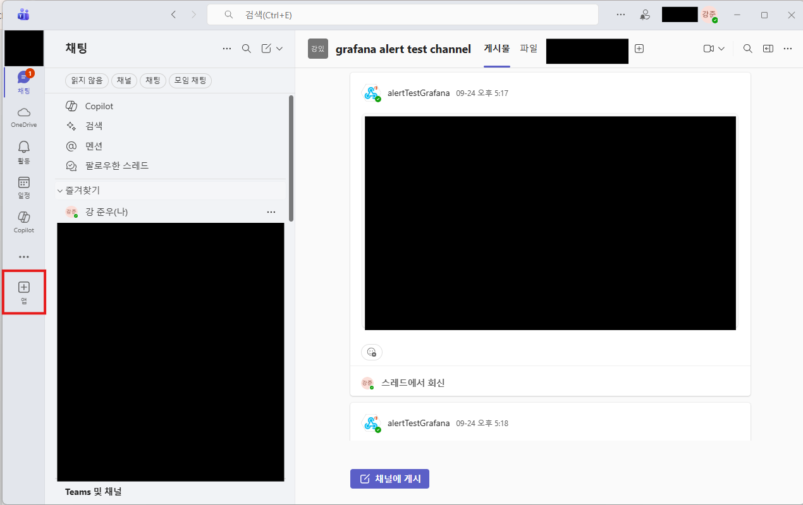
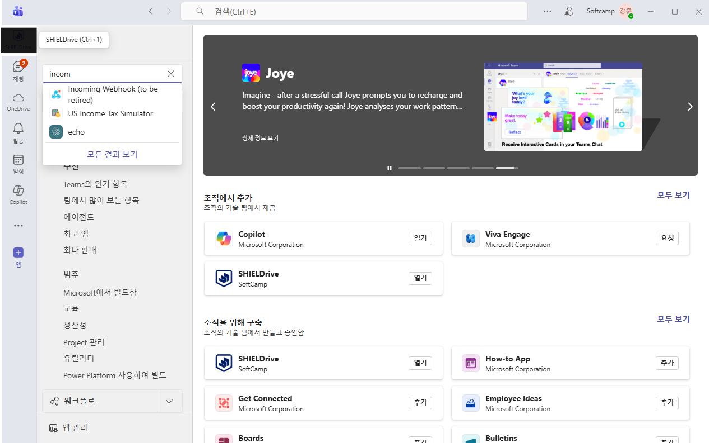
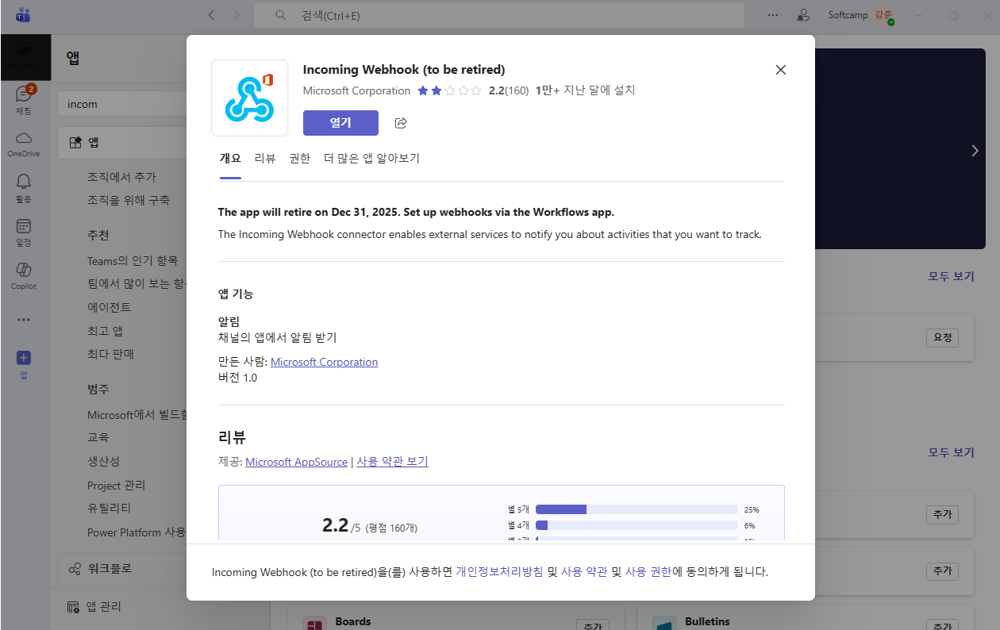
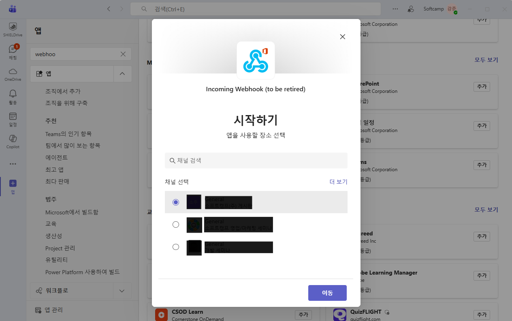

# Intro

회사에서 Grafana에서 이상치를 관측했을 때 자동으로 Teams로 알림을 보낼 수 있게 Webhook을 등록해보라는 요청이 옴. 웹훅을 생성하고 이를 Grafana에 등록하고 이상치 값을 설정하는 과정을 정리해보는 시간을 가지겠습니다.

## 목차

# 본문

## 0. 웹훅(Webhook)이란?

웹훅이 무엇인지 아시는 분은 넘어가셔도 됩니다. [Webhook URL 생성으로 바로가기](#1-teams에서-webhook-url-생성하기)

 

간단한 설명과 예시로 웹훅을 알아보겠습니다.

> 웹훅은 **애플리케이션 간 데이터 전송 자동화를 위한 구현 방식** 중 하나로, 한 **애플리케이션에서 특정 이벤트가 발생하면 실시간으로 데이터나 알림을 다른 애플리케이션으로 전송**할 수 있습니다. 

자동화를 위해서 기존의 API 방식이 polling(일정 주기를 간격으로 지속적인 요청을 보내기)을 사용하는 것과 달리, 웹훅은 이벤트가 발생하면 동작합니다. 이것이 Event-driven이라 불리는 이유입니다. 

즉, 실제 이벤트가 발생할 때만 데이터를 전송하므로 리소스를 아낄 수 있고 실시간으로 반응하여 더욱 효율적이고 신속합니다.

 

예를 들어, 월급날에 월급이 들어왔는지 알고싶다면 어떻게 해야할까요? 은행 앱을 주기적으로 확인하며 월급이 들어왔는지 확인해야할 겁니다. 

이것이 기존의 API 방식입니다. **우리(client)가** 주기적으로 **은행(server)에** 계좌 잔액 확인 **요청을 하고** 이에 **은행이 응답하는 방식**입니다. 

반면에 이렇게 하면 어떨까요? 월급이 입금되면 저희에게 문자로 알림이 오게하는 겁니다.

이것이 Webhook의 방식입니다. **은행(server)이** 저희의 **전화번호(Webhook URL)를 등록**하고 **월급이 입금(특정 이벤트 발생)**될 때만 **휴대폰(App)로 알림**을 보냅니다.

 

웹훅은 앱에서 발생하는 특정 이벤트들을 Custom Callback으로 변환 해주는 Event Handler로 Event 정보를 실시간으로 제공하는데 사용됩니다. 

그래서 서버가 클라이언트를 호출하는 방식으로 역방향 API라고도 불립니다.

서버측에서 **데이터를 보낼 URL 주소**를 **Callback URL**이라고 부릅니다. 또는 **웹훅 엔드포인트**, **Target**으로 부르기도 합니다.

 

## 1. Teams에서 Webhook URL 생성하기

# 결론

# 참고